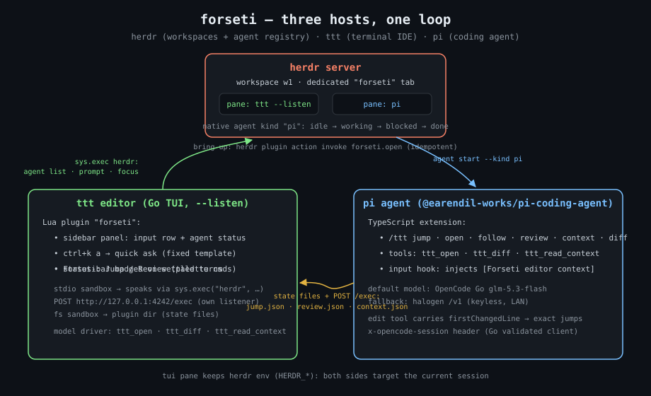
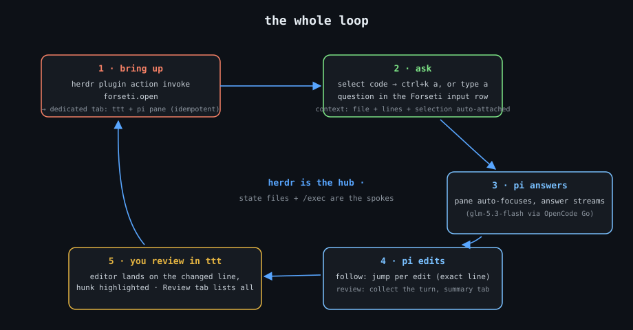

# Forseti

<p align="center">
  
</p>

Forseti ties three local terminal tools into one workflow:

- **[herdr](https://herdr.dev)** — terminal workspace manager (caster/kernel: owns tabs, panes, agent lifecycle)
- **[pi](https://pi.dev)** (`@earendil-works/pi-coding-agent`) — coding agent CLI
- **[ttt](https://tttedit.dev)** — terminal IDE

## The loop

<p align="center">
  
</p>

```sh
# 1 · one command brings up the workspace: ttt editor + pi agent pane
herdr plugin action invoke forseti.open

# 2 · in ttt: select code, ask (input row or ctrl+k a) — answer streams in the pi pane
# 3 · say "open X" — pi itself navigates your editor (ttt_open tool)
# 4 · pi edits — follow lands on the exact changed line, or collects the turn
# 5 · Forseti: Review — one tab lists every change it made, at exact lines
```

## Components (one per host — no daemon anywhere)

| Component | Surface | Implements |
|---|---|---|
| [`herdr-plugin/`](herdr-plugin/README.md) | herdr plugin (TOML + sh) | idempotent bring-up: dedicated tab with ttt (`--listen`) + pi via native `agent start --kind pi` |
| [`ttt-plugin/`](ttt-plugin/README.md) | ttt Lua plugin | ask (input row + `ctrl+k a`), status sidebar/badges, `Forseti: Jump` / `Forseti: Review` |
| [`pi-extension/`](pi-extension/README.md) | pi TS extension | `/ttt jump·open·follow·review·context·diff`, `/herd agents`, model tools (`ttt_open`, `ttt_diff`, `ttt_read_context`), prompt context injection |

Docs: [`design`](docs/design.md) · [`implementation plan`](docs/implementation-plan.md) ·
[`spike log (verified facts)`](docs/spikes.md) · [`AGENTS.md`](AGENTS.md)

## Install (all three, from this public repo)

```sh
# herdr plugin
herdr plugin install alytaphoenix/forseti/herdr-plugin

# pi extension (user-level, every pi session)
cp pi-extension/index.ts ~/.pi/agent/extensions/forseti.ts
# or: pi install git:github.com/alytaphoenix/forseti@v0.1.0

# ttt plugin (Lua, once permissions are approved)
cp -R ttt-plugin ~/.config/ttt/plugins/forseti
```

Then run `herdr plugin action invoke forseti.open` (bind it to `prefix+f` via
herdr's `config.toml` — recipe in [`herdr-plugin/README.md`](herdr-plugin/README.md)).

## Status

All phases implemented and **verified live** (bring-up, ask, follow, review, tools,
context injection) — see the [plan](docs/implementation-plan.md) for the test matrix.
`scripts/smoke.sh` is the round-trip gate (currently green).

## Model setup

pi's provider/auth is your own (`/login` inside pi). This repo pins pi's default
model via `.pi/settings.json` (OpenCode Go `glm-5.3-flash` at author time) and works
with any provider pi speaks. Templates: `herdr-plugin` needs herdr ≥ 0.7.0,
`ttt-plugin` needs ttt ≥ 1.6.0 running with `--listen`.

## Known constraints (v1, by design)

- Single forseti-enabled ttt per machine — the jump hand-off goes through ttt's
  `--listen` control server, which binds fixed `127.0.0.1:4242` (unauthenticated
  local-machine trust, documented in ttt source as a debug tool).
- Follow mode and Review are mutually exclusive; Review supersedes per-edit jumps.
- The Forseti sidebar tab may sit behind ttt's tab-strip overflow (`»`) on first
  run — drag it left once; ttt persists the order.
